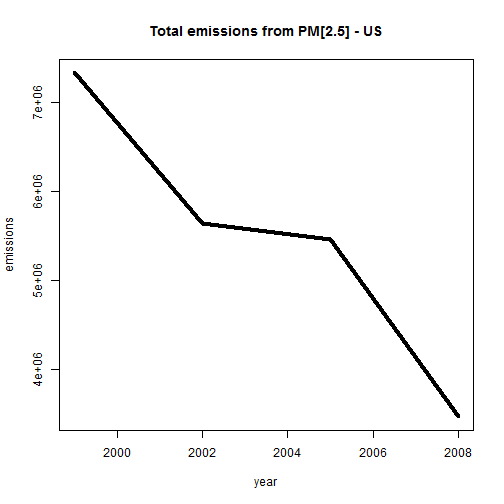
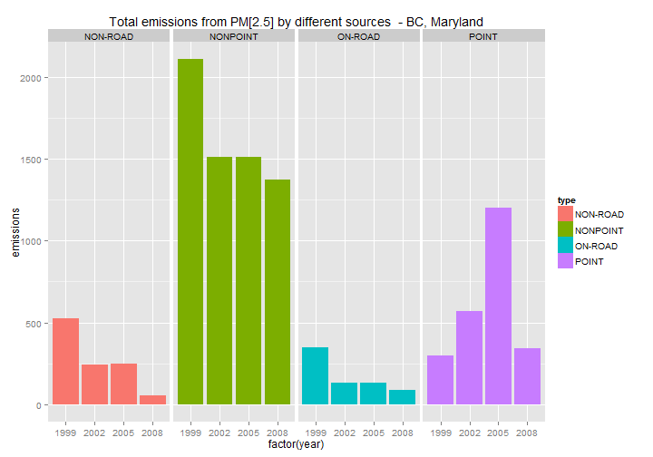
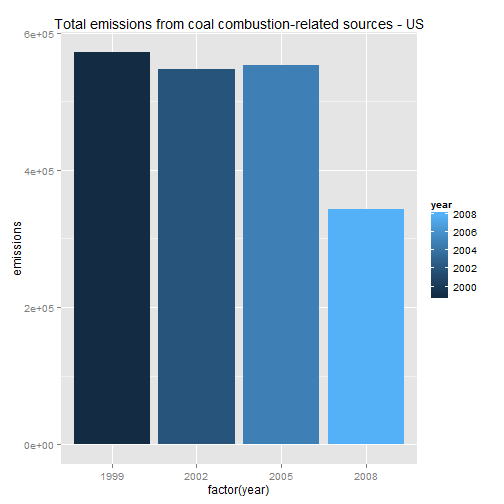
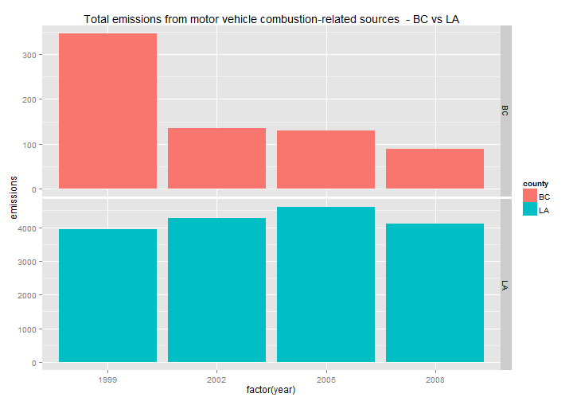

```r
if(!file.exists("NEI")){
        file.url <- "https://d396qusza40orc.cloudfront.net/exdata%2Fdata%2FNEI_data.zip"
        
        download.file(file.url, "NEI.zip")
        
        unzip("NEI.zip", exdir="NEI")
}
```


Read in the R objects
- This first line will likely take a few seconds. Be patient!

```r
NEI <- readRDS("NEI/summarySCC_PM25.rds")
SCC <- readRDS("NEI/Source_Classification_Code.rds")

names(NEI) <- tolower(names(NEI))
names(SCC) <- tolower(names(SCC))
```


1. Plot 1

Have total emissions from PM2.5 decreased in the United States from 1999 to 2008? Using the base plotting system, make a plot showing the total PM2.5 emission from all sources for each of the years 1999, 2002, 2005, and 2008.

- Yes! The total emissions have decreased.


```r
total.emissions <- aggregate(emissions ~ year, NEI,sum)
plot(total.emissions, type="l", lwd="4", main="Total emissions from PM[2.5] - US")
```

 

2. Plot 2

Have total emissions from PM2.5 decreased in the Baltimore City, Maryland (fips == "24510") from 1999 to 2008? Use the base plotting system to make a plot answering this question.

- Yes! The total emissions in BC, Maryland have decreased.


```r
BC.emissions <- aggregate(emissions ~ year, NEI[NEI$fips =="24510",], sum)

plot(BC.emissions, type="l", lwd="4", main="Total emissions from PM[2.5] - BC, Maryland")
```

 

3. Plot 3

Of the four types of sources indicated by the type (point, nonpoint, onroad, nonroad) variable, which of these four sources have seen decreases in emissions from 1999-2008 for Baltimore City? Which have seen increases in emissions from 1999-2008? Use the ggplot2 plotting system to make a plot answer this question.


- The **nonpoint, onroad** and **nonroad** sources have seen overall progressive decreases in emissions from 1999-2008.

- The **point** source has seen an overall increase in that time period.


```r
require(ggplot2)

BC.emissions.1 <- aggregate(emissions ~ year + type, NEI[NEI$fips =="24510",], sum)

qplot(x=factor(year), y=emissions, data=BC.emissions.1, 
      fill=type,geom="bar", stat="identity",position="dodge", 
      main="Total emissions from PM[2.5] by different sources  - BC, Maryland") +  facet_grid(.~type)
```

 


4. Plot 4
Across the United States, how have emissions from coal combustion-related sources changed from 1999-2008?

- They have decreased overall.


```r
tmp <- SCC[grepl("coal", SCC$ei.sector, ignore.case=T),]

coal.emissions <-  aggregate(emissions~year, NEI[NEI$scc %in% tmp$scc,] ,sum)

qplot(x=factor(year), y=emissions, data=coal.emissions, 
      fill=year,geom="bar", stat="identity",position="dodge", 
      main="Total emissions from coal combustion-related sources - US")
```

 


5. Plot 5
How have emissions from motor vehicle sources changed from 1999-2008 in Baltimore City?

- They have decreased overall.


**NOTE**

According to Section 4.6.1 in the [documentation on the epa.gov website](http://www.epa.gov/ttn/chief/net/2011nei/2011_nei_tsdv1_draft2_june2014.pdf), starting on page 215:

> The four sectors for on-road mobile sources include emissions from motorized vehicles that are normally operated on public roadways. This includes passenger cars, motorcycles, minivans, sport-utility vehicles, light-duty trucks, heavy-duty trucks, and buses. The sectors include emissions from parking areas as well as emissions while the vehicles are moving.


```r
BC.emissions.2 <- aggregate(emissions ~ year , NEI[NEI$fips =="24510" & NEI$type == "ON-ROAD",], sum)

qplot(x=factor(year), y=emissions, data=BC.emissions.2, 
      fill=year,geom="bar", stat="identity",position="dodge", 
      main="Total emissions from motor vehicle combustion-related sources  - BC, Maryland") 
```

 


6. Plot 6

Compare emissions from motor vehicle sources in Baltimore City with emissions from motor vehicle sources in Los Angeles County, California (fips == "06037"). Which city has seen greater changes over time in motor vehicle emissions?

- From 1999-2008, Baltimore City managed to drop its vehicle emissions by more than 2/3rds while Los Angeles barely moved from its original baseline level.


```r
LA.emissions <- aggregate(emissions ~ year , NEI[NEI$fips =="06037" & NEI$type == "ON-ROAD",], sum)

LA.emissions$county <- "LA"
BC.emissions.2$county <- "BC"

county.emissions <- rbind(LA.emissions, BC.emissions.2)


qplot(x=factor(year), y=emissions, data=county.emissions, 
      fill=county,geom="bar", stat="identity",position="dodge", 
      main="Total emissions from motor vehicle combustion-related sources  - BC vs LA") + facet_grid(county  ~ ., scales="free") 
```

 
